# 0x00 上传流程概述

一个文件以http协议上传的时候，将以post请求发送至web服务器。服务器接受并同意后，用户与web服务器建立连接，并且传输数据

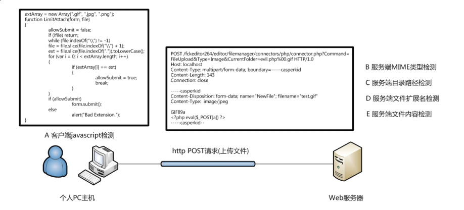

而一般文件上传过程中检测部分由

- A 客户端javascript检测 （检测文件扩展名）
- B 服务端MIME类型检测 （检测Content—Type）
- C 服务端目录路径检测（检测和path相关参数）
- D 服务端文件扩展名检测 （检测文件扩展名）
- E 服务端内容检测 （检测是否含有恶意代码）


# 0x01 客户端检测绕过检测 （js检测）
这一类型特征就是你会收到一个`javascript`的弹窗

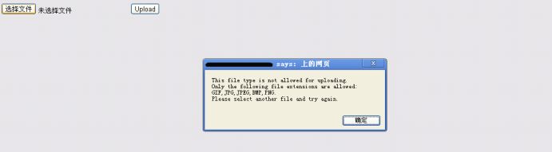

## 绕过方式

利用`firebug`禁用js
通过`brup`等代理工具

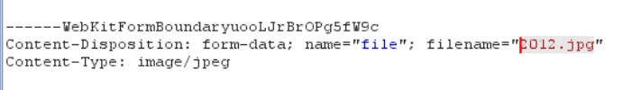

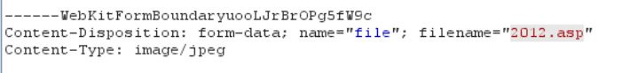
即可成功上传

# 0x02 服务端检测绕过 （MIME检测）
一般来说界面如图

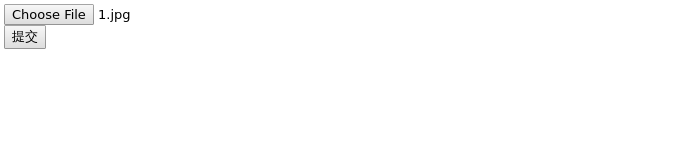

源码类似如下

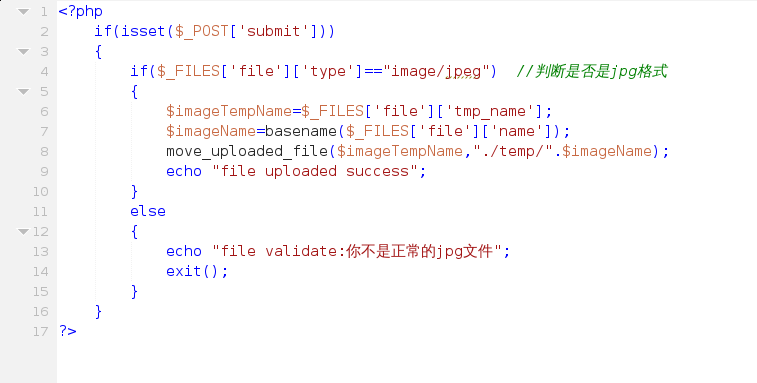

可以看到里面仅仅只判断了 `Content-Type`

## 绕过方式
通过`brup`等代理工具

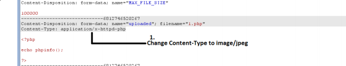

# 0x03 服务端检测绕过 （扩展名检测）

常常采用一个黑名单或者白名单，对上传的文件的扩展名进行检测，符合条件才允许上传

## 绕过方式

### 文件名大小写绕过
  如果，在代码层没有进行大小写统一，用AsP，pHp类似的文件名绕过黑名单
### 名单列表绕过
  利用黑名单里没有的，并且能够成功执行的命名，进行绕过，例如php3，php4之类的
  白名单，截断绕过
### 特殊文件名绕过
  在windows下有些文件名是不被允许的，将http包里将文件名改为`test.asp.`或`test.asp_`（此处下划线为空格）这种命名方式在windows系统自动去掉点和空格
### 截断绕过
  0x00截断绕过，在asp程序有这种漏洞
  传入name=`test.jpg0x00`
  type=gettype(name) 此处该函数处理方式从后往前扫描，因为0x00不是扩展名，然后获得出来的文件名即是`.jpg`
  if（type==jpg）
    savefiletopath（uploadpath.name，name）但在此处0x00截断最后存入磁盘的是`test.jpg`

### .htaccess 文件攻击
  在apache里，这个文件作为一个配置文件，可以用来控制所在目录的访问权限以及解析设置。即是，可以通过设置可以将该目录下的所有文件作为php文件来解析，即可绕过
#### 方式
  利用某些写文件函数复写`.htaccess`文件，即可任意定义解析名单
  通过一个.htaccess 文件调用 php 的解析器去解析一个文件名中只要包含"haha"这个字符串的
  任意文件，所以无论文件名是什么样子，只要包含"haha"这个字符串，都可以被以 php 的方
  式来解析，是不是相当邪恶，一个自定义的.htaccess 文件就可以以各种各样的方式去绕过很
  多上传验证机制
  建立一个`.htaccess`文件内容如下
  ```
  <FilesMatch "haha">
  SetHandler application/x-httpd-php
  </FilesMatch>
  ```
  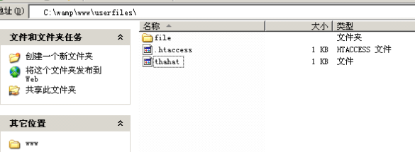

  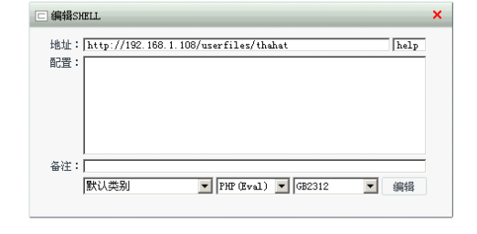

  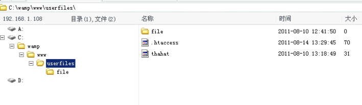

# 0x04 服务端检测绕过（文件内容检测）

### 文件头检测
- jpg文件头

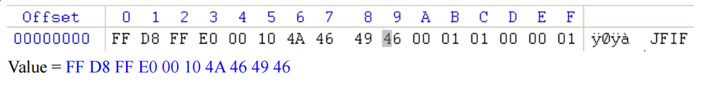

- gif文件头
- 
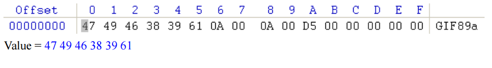

- png文件头
- 
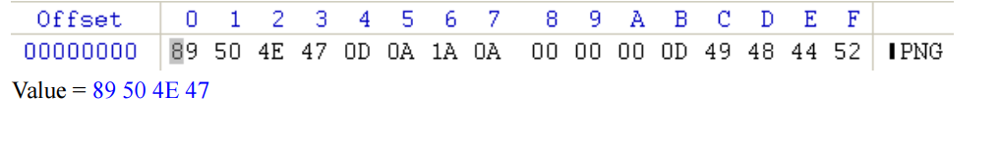

#### 方式

常见图片一句话形式

```
GIF89a
(...some binary data for image...)
<?php phpinfo(); ?>
(... skipping the rest of binary data ...)
```

### 文件加载检测

这个检测应该是最难绕过的，一般是调用API函数去进行文件加载测试，更有甚者二次渲染

#### 方式
对渲染/加载测试攻击 代码注入绕过
对二次渲染攻击 攻击加载器

代码注入，和文件头的处理方式大致相同不过有了一个限定，你不能破坏这张图片，只能把你要的代码添加在空白区。保持文件结构的完整

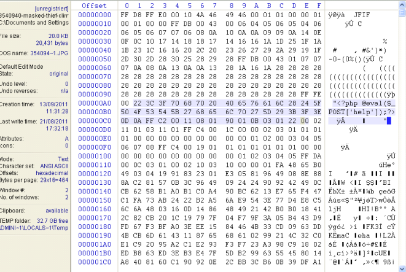

#### 二次渲染
单独列出来这个方式有点特殊
我们如果还是上传一个过加载检测的图片


然后再从服务器上下载回本地

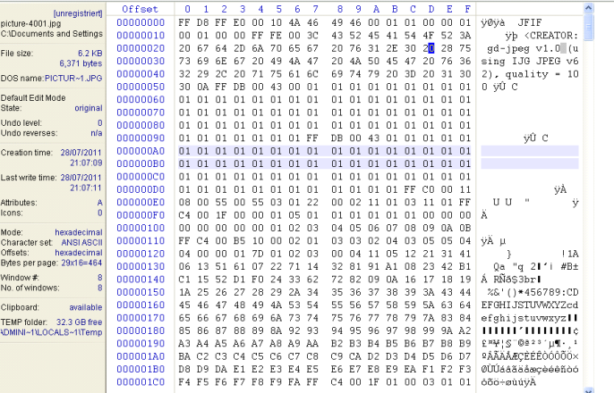

并且图片里多了`CREATOR: gd-jpeg v1.0 (using IJG JPEG v62)`
说明使用GD php 的gd库

这里是某后台的调用GD库二次渲染的代码

```
function image_gd_open($file, $extension)
{
$extension = str_replace('jpg', 'jpeg', $extension);
$open_func = 'imageCreateFrom'. $extension; //函数名变成 imageCreateFrompng 之类
if (!function_exists($open_func))
{
return FALSE;
}
return $open_func($file); //变成 imagecreatefrompng('/tmp/php0lbTOn')
}
```
将你上传的文件中属于图片部分的数据抓取出来，再使用自己的API或者函数重新将这张图片生成出来保存在服务端

# 0x05 解析攻击

## 直接攻击
直接能上传一个php文件绕过客户端`js检测`或者`服务端MIME检测`

## 配合解析
先将代码以任意文件形式上传到服务器，通过`php文件包含`
`web服务器解析漏洞``.htaccess解析`等
相互配合达成解析为目标文件类型的攻击

### Apache 解析漏洞

- 解析：`test.php.jkl` 并没`.jkl`后缀的文件，而`Apache`的某些版本中会直接当成`php`来解析
- 描述：若一个文件名`abc.x1.x2.x3`，`Apache`会从`x3`开始解析，如果`x3`不是一个能解析的扩展名，就往前解析`x2`以此往复，直到能遇到一个能解析的文件名为止
- 对应版本：
```
WampServer2.0 All Version (WampServer2.0i / Apache 2.2.11) [Success]
WampServer2.1 All Version (WampServer2.1e-x32 / Apache 2.2.17) [Success]
Wamp5 All Version (Wamp5_1.7.4 / Apache 2.2.6) [Success]
AppServ 2.4 All Version (AppServ - 2.4.9 / Apache 2.0.59) [Success]
AppServ 2.5 All Version (AppServ - 2.5.10 / Apache 2.2.8) [Success]
AppServ 2.6 All Version (AppServ - 2.6.0 / Apache 2.2.8) [Success]
```
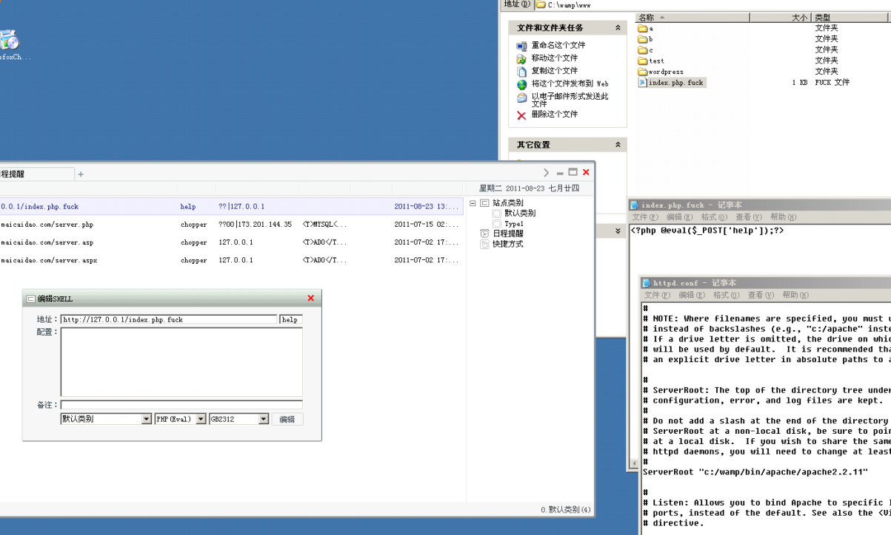

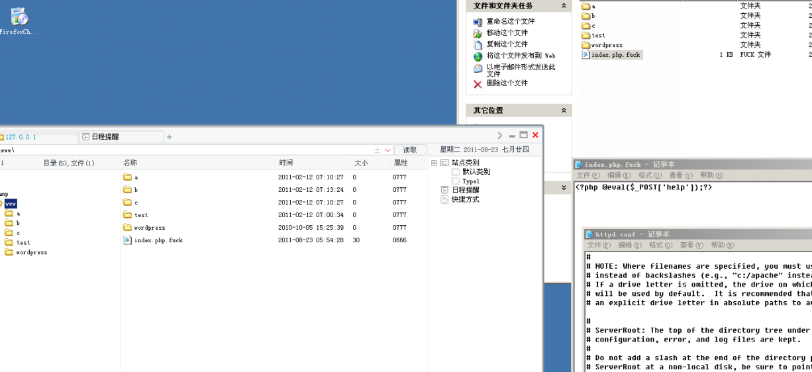

### IIS 解析漏洞

- 解析：`test.asp/jkl`,`IIS`的某些版本中会直接当成`asp`来解析;`test.asp;jkl`,`IIS`某些版本也会按照`asp`来解析；`任意文件名/任意文件名.php`，`IIS`某些版本会直接当`php`来解析
- 描述：`IIS6.0`在解析`asp`时有两个解析漏洞，一个是如果任意目录名包含`.asp`字符串，那么这个目录下的所有文件都会按照`asp`去解析，另一个是文件名中含有`asp;`就会优先当作`asp`来解析
`IIS7.0/7.5`对php解析有类似`Nginx`的解析漏洞只要对任意文件名在url后面追加上字符串`/任意文件名.php`就会按照php去解析

- 对应版本：
```
IIS6.0 (Win2003 SP2 + IIS6.0) [Success]
IIS7.0 (Win2008 R1 + IIS7.0) [Success]
IIS7.5 (Win2008 R2 + IIS7.5) [Success]
```

- 注意
`任意文件名/任意文件名.php`这个漏洞是因为`php-cgi`

`IIS6.0`

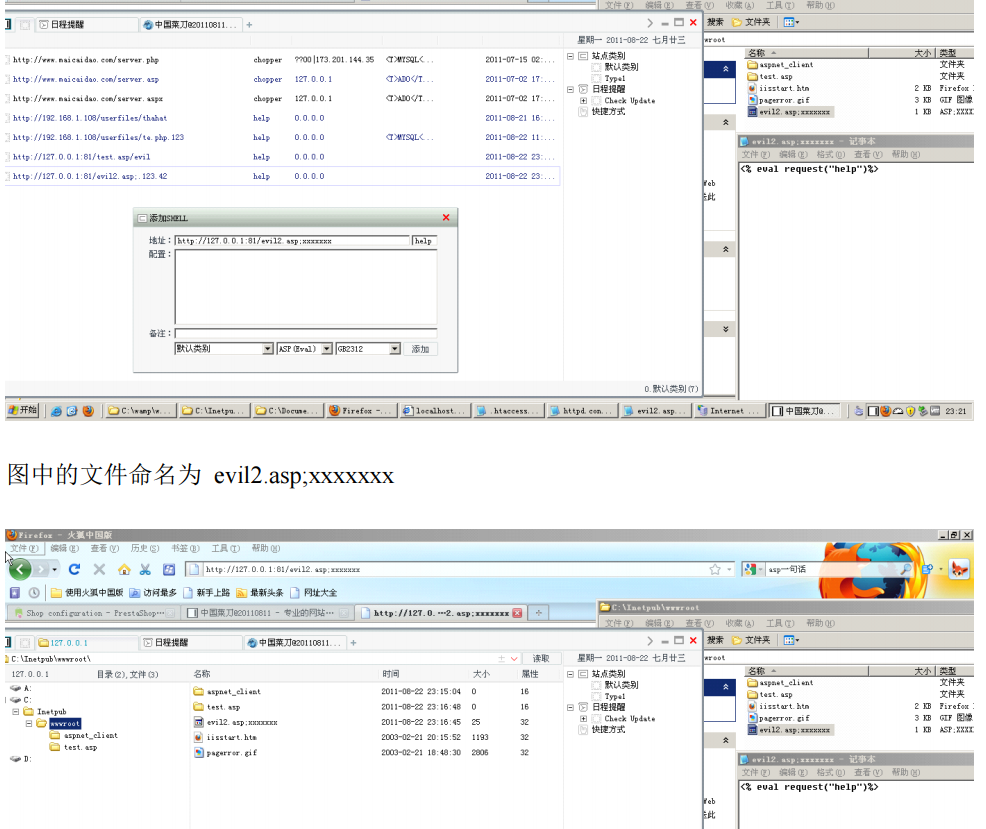

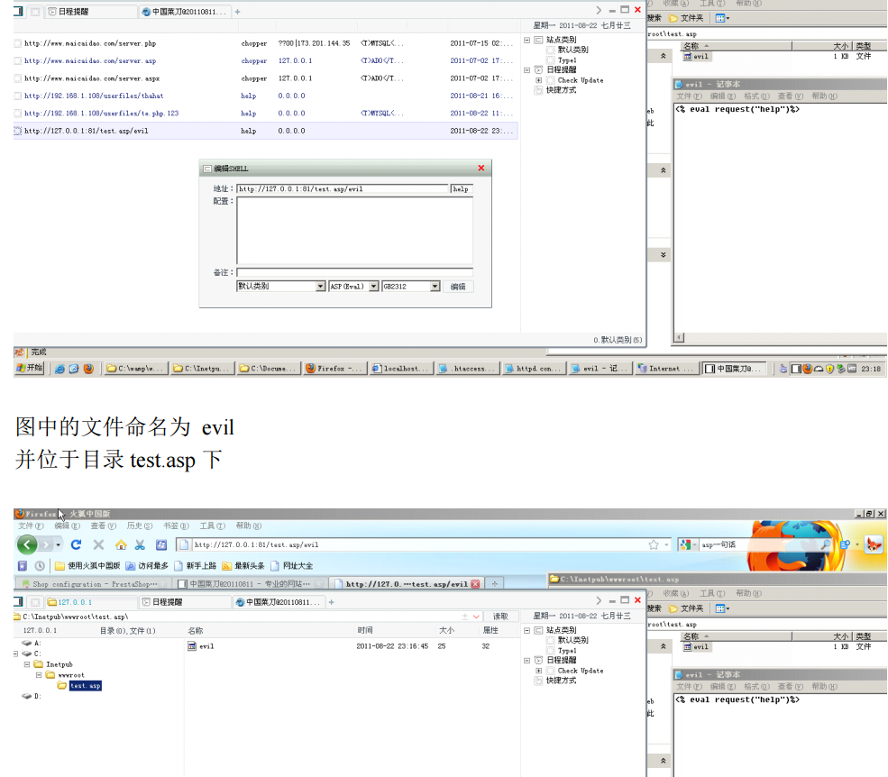

`IIS7`

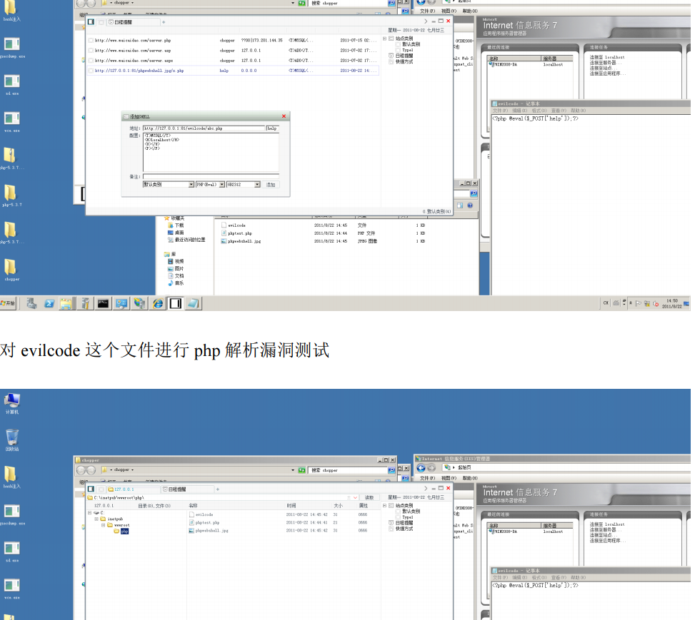

### Nginx 解析漏洞
- 解析：`任意文件名/任意文件名.php`;`任意文件名%00.php`都当作php来解析
- 描述：例如原文件名`test.jpg`但内容包含php一句话添加为`test.jpg/x.php`来进行解析攻击
低版本可以子任意文件名后添加`%00.php`进行截断攻击

- 对应版本：
```
nginx 0.5.* [Success]
nginx 0.6.* [Success]
nginx 0.7 <= 0.7.65 [Success]
nginx 0.8 <= 0.8.37 [Success]
```

- 注意
`任意文件名/任意文件名.php`这个漏洞是因为`php-cgi`

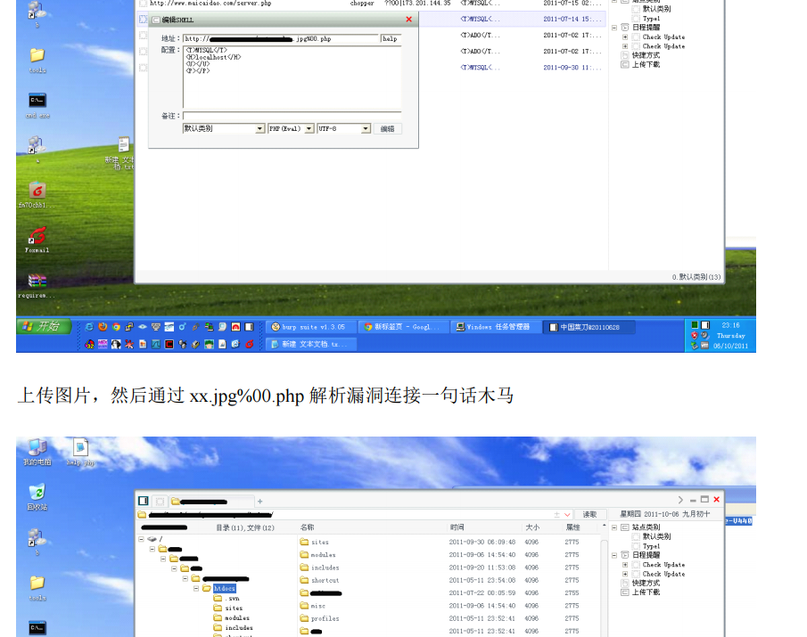

### php-cgi
这类漏洞主要出现在`IIS`和`Nginx`这类以`CGI`形式调用`php`的`web`应用程序
而`Apache`通常是以`module`的形式去调用`php`，所以很少出现这个漏洞

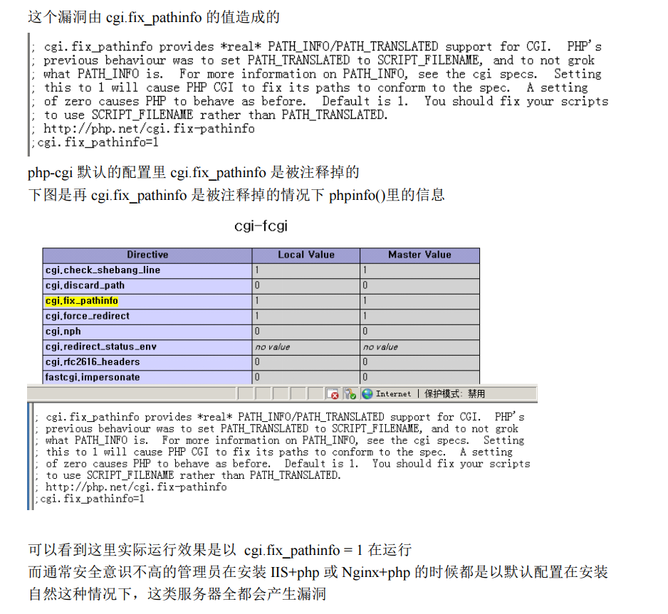
可以看到这里实际运行效果是以 `cgi.fix_pathinfo = 1` 在运行
而通常安全意识不高的管理员在安装 `IIS+php` 或 `Nginx+php` 的时候都是以默认配置在安装
自然这种情况下，这类服务器全都会产生漏洞


# 总结
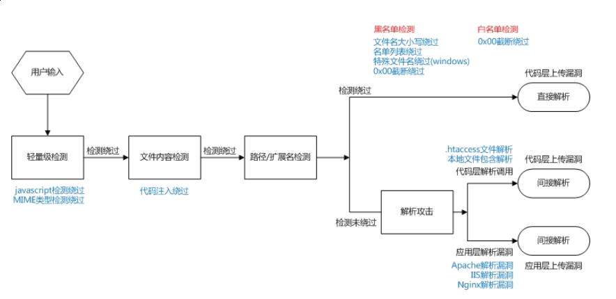

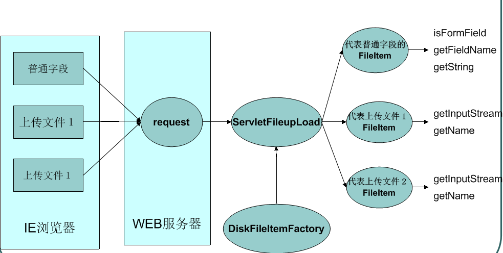
